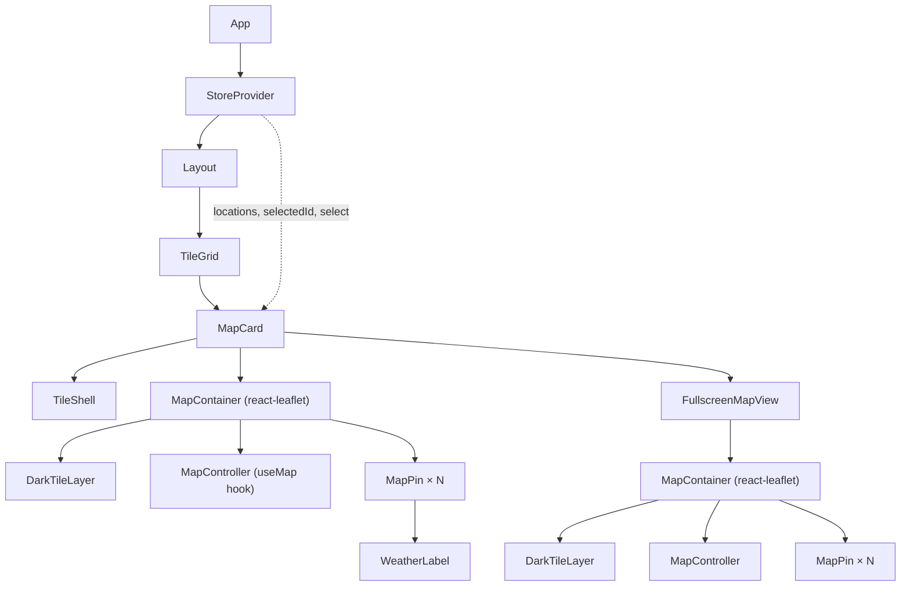

# Design Document: Weather Map Card

## Overview

The Weather Map Card adds an interactive map tile to the existing dashboard, showing all saved locations as clickable pins with inline weather labels. It follows the same frosted-glass visual language as every other tile in `TileGrid` and supports expansion to a fullscreen overlay for detailed exploration.

**Key design decisions:**

- `react-leaflet` is already a declared dependency in `frontend/package.json`, so no new library needs to be installed.
- Map pins and labels are rendered as custom Leaflet `DivIcon` markers so they can be styled with Tailwind/CSS without fighting Leaflet's default icon system.
- Fullscreen state is managed locally inside `MapCard`; the global store is not extended.
- All map interaction logic (fit-bounds, zoom, pan) is executed imperatively through the Leaflet `Map` instance obtained from `useMap()`.

---

## Architecture



The `MapCard` component reads `locations`, `selectedId`, and `select` from the global store via `useStore()`. It owns one piece of local state: `isFullscreen: boolean`. When `isFullscreen` is true it renders `FullscreenMapView` as a portal attached to `document.body` so it sits on top of all content.

---

## Components and Interfaces

### `MapCard`

Top-level tile component. Placed inside `TileGrid` with `col-span-2`.

```tsx
// frontend/src/components/MapCard.tsx
export function MapCard(): JSX.Element;
```

Responsibilities:

- Read `locations`, `selectedId`, `select` from `useStore()`.
- Manage `isFullscreen` local state.
- Render `TileShell` with a map pin icon and "Map" title.
- Render the compact `MapContainer` (scroll-zoom disabled, attribution hidden).
- Render the "No saved locations" overlay when `locations.length === 0`.
- Render the expand button (top-right corner of the tile, accessible via keyboard).
- When `isFullscreen` is true, render `FullscreenMapView` via `ReactDOM.createPortal`.

### `FullscreenMapView`

Fullscreen overlay map.

```tsx
interface FullscreenMapViewProps {
  locations: Location[];
  selectedId: number | null;
  onSelect: (id: number) => void;
  onClose: () => void;
  expandButtonRef: React.RefObject<HTMLButtonElement>;
}

function FullscreenMapView(props: FullscreenMapViewProps): JSX.Element;
```

Responsibilities:

- Cover `100vw × 100vh` with `position: fixed; inset: 0; z-index: 9999`.
- Render `MapContainer` with full interaction (zoom buttons, drag, scroll-zoom).
- Render attribution visible at bottom-right (Leaflet default).
- Display a close button in the top-right corner; on activation close the overlay and return focus to `expandButtonRef.current`.
- Trap keyboard focus within the overlay (`Tab` / `Shift+Tab` cycle).
- Close on `Escape` key, returning focus to the expand button.
- Move initial focus to the close button on mount.

### `MapController`

An internal render-less component placed inside `MapContainer` that imperatively drives viewport changes.

```tsx
interface MapControllerProps {
  locations: Location[];
  padding: number; // px — passed as [padding, padding] to fitBounds
}

function MapController({ locations, padding }: MapControllerProps): null;
```

Uses `useMap()` from `react-leaflet`. Runs a `useEffect` keyed on `locations` to:

- Zero locations → `map.setView([0, 0], 2)`.
- One location → `map.setView([lat, lng], 12)`.
- Two or more locations → `map.fitBounds(bounds, { padding: [padding, padding] })`.

### `MapPin`

A custom marker rendered as a `DivIcon`.

```tsx
interface MapPinProps {
  location: Location;
  isSelected: boolean;
  onSelect: (id: number) => void;
}

function MapPin({ location, isSelected, onSelect }: MapPinProps): JSX.Element;
```

Uses `react-leaflet`'s `<Marker>` with a custom `DivIcon` whose HTML is a small rendered div. The pin circle is:

- **Unselected**: 12 × 12 px, `bg-sky-400`, white border.
- **Selected**: 20 × 20 px (≥ 1.5× unselected), `bg-amber-400`, white border, drop-shadow.

The `Marker` registers `eventHandlers` for `click` to call `onSelect`. The keyboard handler is attached via `useEffect` on the underlying Leaflet marker element after mount, listening for `keydown` with `Enter` or `Space`.

### `WeatherLabel`

Rendered as the tooltip-like text inside the `DivIcon` HTML string above the pin circle.

```tsx
function formatWeatherLabel(weather: WeatherSnapshot): string;
```

Pure function — no JSX, produces a plain string for use inside the `DivIcon` HTML. Logic:

1. If `temperature_c` is a finite number → `${Math.round(temperature_c)}°`
2. Else if `condition` is non-null → `condition.length > 12 ? condition.slice(0, 12) + '…' : condition`
3. Else → `"--"`

### `TileShell` (existing, unchanged)

`MapCard` reuses `TileShell` directly from `Tiles.tsx` via a named export or inline duplication if a shared export is not available. Since `TileShell` is not currently exported, `MapCard` either:

- Exports `TileShell` from `Tiles.tsx` (preferred — single source of truth), or
- Inlines a functionally identical `MapTileShell`.

The preferred approach is to add `export` to `TileShell` in `Tiles.tsx`.

### New Icon: `MapPinIcon` and `ExpandIcon`

Two icons are added to `icons.tsx`:

```tsx
export function MapPinIcon({ className }: IconProps): JSX.Element;
export function ExpandIcon({ className }: IconProps): JSX.Element;
```

---

## Data Models

No new data models are introduced. The feature consumes existing types exclusively:

```ts
// Already in types.ts — consumed as-is
interface Location {
  id: number;
  latitude: number;
  longitude: number;
  created_at: string;
  weather: WeatherSnapshot;
}

interface WeatherSnapshot {
  temperature_c: number | null;
  condition: string | null;
  // ...other fields not used by this feature
}
```

### Local state inside `MapCard`

```ts
const [isFullscreen, setIsFullscreen] = useState<boolean>(false);
```

### `formatWeatherLabel` input/output contract

| `temperature_c`   | `condition` | Output                                              |
| ----------------- | ----------- | --------------------------------------------------- |
| finite number     | any         | `"24°"`                                             |
| null / non-finite | non-null    | `"Partly Cloudy"` (truncated to 12 + `…` if longer) |
| null / non-finite | null        | `"--"`                                              |

---

## Correctness Properties

_A property is a characteristic or behavior that should hold true across all valid executions of a system — essentially, a formal statement about what the system should do. Properties serve as the bridge between human-readable specifications and machine-verifiable correctness guarantees._

### Property 1: Weather label finite temperature display

_For any_ `WeatherSnapshot` where `temperature_c` is a finite number, `formatWeatherLabel` SHALL return a string equal to `Math.round(temperature_c)` followed by `"°"`.

**Validates: Requirements 3.1**

### Property 2: Weather label condition fallback

_For any_ `WeatherSnapshot` where `temperature_c` is null or non-finite and `condition` is a non-null string, `formatWeatherLabel` SHALL return a string that is either the full condition string (if its length ≤ 12) or the first 12 characters followed by `"…"`.

**Validates: Requirements 3.2**

### Property 3: Weather label null fallback

_For any_ `WeatherSnapshot` where `temperature_c` is null or non-finite and `condition` is null, `formatWeatherLabel` SHALL return `"--"`.

**Validates: Requirements 3.3**

### Property 4: Weather label output length bound

_For any_ `WeatherSnapshot` where `temperature_c` is null or non-finite and `condition` is a non-null string, the string returned by `formatWeatherLabel` SHALL never exceed 13 characters (12 content characters + `"…"`).

**Validates: Requirements 3.2**

### Property 5: Pin count matches location count

_For any_ array of `Location` objects passed to `MapCard`, the number of `MapPin` markers rendered in the map SHALL equal the length of that array (including zero).

**Validates: Requirements 2.1, 2.2**

### Property 6: Selected pin visual distinction

_For any_ array of `Location` objects and any `selectedId` value (including null), the set of `MapPin` markers with the selected visual style SHALL be exactly those whose `location.id` equals `selectedId`. When `selectedId` is null, no pin SHALL have the selected style.

**Validates: Requirements 2.5, 7.1, 7.4**

### Property 7: Pin click triggers correct selection

_For any_ array of `Location` objects, when the user clicks or activates any `MapPin`, the `select` action SHALL be called with exactly that pin's `location.id` and no other id.

**Validates: Requirements 7.2**

---

## Error Handling

| Scenario                                                   | Behavior                                                                                                                                                                                             |
| ---------------------------------------------------------- | ---------------------------------------------------------------------------------------------------------------------------------------------------------------------------------------------------- |
| Tile provider network failure                              | Leaflet renders blank tiles; no error thrown. The rest of the card remains functional.                                                                                                               |
| `location.latitude` / `longitude` is `NaN` or out-of-range | Leaflet silently clips the coordinate. `MapController`'s `fitBounds` call is guarded with a check that all coordinates are finite numbers before calling `fitBounds`; malformed entries are skipped. |
| Zero locations on mount                                    | `MapController` sets view to `(0, 0)` zoom 2. The overlay "No saved locations" message is displayed.                                                                                                 |
| `weather` is `undefined` or `null` on a `Location`         | `formatWeatherLabel` treats all fields as absent → returns `"--"`.                                                                                                                                   |
| Portal target (`document.body`) unavailable during SSR     | Not applicable — this is a Vite/browser-only app.                                                                                                                                                    |
| Focus return fails (expand button unmounted)               | `expandButtonRef.current` is checked before calling `.focus()`; failure is silently ignored.                                                                                                         |

---

## Testing Strategy

### PBT Applicability Assessment

This feature is primarily a UI / React component with one pure utility function (`formatWeatherLabel`) that has meaningful input variance. The map interaction (fit-bounds, zoom) depends on Leaflet's imperative API and is not a pure function. PBT is appropriate for `formatWeatherLabel` and the pin-count invariant (testable with a lightweight render harness).

### Unit Tests (example-based)

Located in `frontend/src/components/__tests__/MapCard.test.tsx`.

Covers:

- `MapCard` renders the "No saved locations" overlay when `locations` is empty.
- `MapCard` renders `n` pins for `n` locations (smoke: 1, 3).
- The selected pin is visually distinct (has the selected CSS class).
- Clicking a pin calls `select` with the correct location `id`.
- The expand button opens the fullscreen overlay.
- The close button in `FullscreenMapView` closes the overlay and restores focus.
- Pressing `Escape` in `FullscreenMapView` closes the overlay.
- `formatWeatherLabel` with a concrete finite temperature.
- `formatWeatherLabel` with a condition exactly 12 characters (no ellipsis).
- `formatWeatherLabel` with a condition of 13 characters (gets truncated + `…`).
- `formatWeatherLabel` with both null → returns `"--"`.

### Property-Based Tests

Located in `frontend/src/components/__tests__/formatWeatherLabel.property.test.ts` (pure function properties) and `frontend/src/components/__tests__/MapCard.property.test.tsx` (component-level properties).

Uses **fast-check** (installable as `npm install -D fast-check` in the frontend workspace).

Each test runs a minimum of **100 iterations**.

```ts
// Tag format: Feature: weather-map-card, Property {n}: {property_text}
```

**Property 1 — finite temperature display**

```
Feature: weather-map-card, Property 1: Weather label finite temperature display
```

Generator: arbitrary finite `number` for `temperature_c`, arbitrary nullable `condition`.
Assert: output === `${Math.round(temperature_c)}°`.

**Property 2 — condition fallback**

```
Feature: weather-map-card, Property 2: Weather label condition fallback
```

Generator: non-finite / null `temperature_c`, arbitrary non-empty `string` for `condition`.
Assert: output is either the full condition (≤ 12 chars) or `condition.slice(0,12) + '…'` (> 12 chars).

**Property 3 — null fallback**

```
Feature: weather-map-card, Property 3: Weather label null fallback
```

Generator: null/NaN `temperature_c`, null `condition`.
Assert: output === `"--"`.

**Property 4 — output length bound**

```
Feature: weather-map-card, Property 4: Weather label output length bound
```

Generator: null/NaN `temperature_c`, arbitrary non-null `string` for `condition`.
Assert: output.length ≤ 13.

**Property 5 — pin count matches location count**

```
Feature: weather-map-card, Property 5: Pin count matches location count
```

Generator: arbitrary array of valid `Location` objects (0–20 entries).
Assert: rendered marker count (queried from DOM) equals `locations.length`.

**Property 6 — selected pin visual distinction**

```
Feature: weather-map-card, Property 6: Selected pin visual distinction
```

Generator: arbitrary array of `Location` objects and arbitrary `selectedId` (one of the ids, or null).
Assert: exactly the pins matching `selectedId` have the selected CSS class; all others do not.

**Property 7 — pin click triggers correct selection**

```
Feature: weather-map-card, Property 7: Pin click triggers correct selection
```

Generator: arbitrary array of `Location` objects (1–10), arbitrary index to click.
Assert: mock `select` function is called once with `locations[clickedIndex].id`.

### Integration / Accessibility Checks

- Keyboard navigation: expand button is reachable by `Tab`; close button receives initial focus in fullscreen; `Escape` closes the overlay (tested in unit tests via `@testing-library/user-event`).
- Focus trapping: only elements within `FullscreenMapView` are reachable while it is open.
- Attribution visible in fullscreen, suppressed in compact view (Leaflet `attributionControl` prop).
